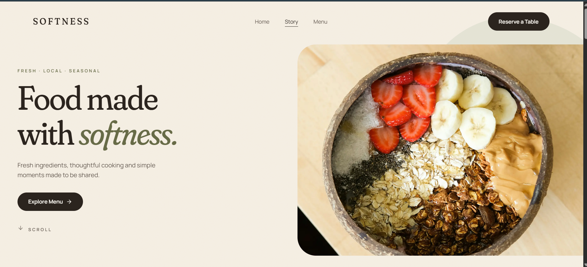

# Softness

A restaurant website built as a frontend portfolio project editorial, warm, and designed around one action: reserving a table.

**Food made with softness.**



## Live demo

[softness-restaurant.vercel.app](https://softness-restaurant.vercel.app)

## Tech stack

- **Next.js 16** (App Router)
- **React 19**
- **JavaScript** : no TypeScript, by design
- **Tailwind CSS v4** :  design tokens defined in `@theme`
- **Framer Motion** :  scroll-linked animation
- **Lucide React** :  icons
- **Fontsource** :  self-hosted Fraunces + Manrope

## Pages

- **`/`** : landing page: hero, brand story with an infinite dish marquee, signature dishes, atmosphere, closing call to action
- **`/menu`** : full menu by course, with sticky course navigation that follows your scroll
- **`/reservation`** : booking form with validation and a confirmation state, alongside hours and contact details

## Features

- **Design system first** : colors, typography, easing and custom utilities defined once as Tailwind v4 tokens
- **Editorial layouts** : asymmetrical 12-column compositions rather than card grids
- **Scroll-linked motion** : parallax, curtain reveals, staggered text, all on one shared easing curve
- **Viewport-sized sections** using `svh` units, so full-screen sections fit any device
- **Form handling** : controlled inputs in a single state object, a pure validation function, per-field errors that clear as you type
- **Navigation state** : the navbar reflects the current page, and the current section while scrolling the home page (IntersectionObserver)
- **Mobile designed separately**, not scaled down
- **Accessible** : semantic HTML, focus-visible styles, `aria` attributes, and full `prefers-reduced-motion` support

## Project structure

```
softness/
├── app/
│   ├── layout.js             → HTML shell, fonts, navbar + footer
│   ├── page.js               → composes the landing page sections
│   ├── globals.css           → design tokens & base styles
│   ├── menu/
│   │   └── page.js           → full menu, by course
│   └── reservation/
│       └── page.js           → booking form + practical details
│
├── components/
│   ├── Navbar.jsx            → scroll state, active link, mobile menu
│   ├── Hero.jsx
│   ├── BrandStatement.jsx
│   ├── DishMarquee.jsx       → infinite scrolling dish strip
│   ├── SignatureDishes.jsx
│   ├── Atmosphere.jsx
│   ├── ReservationCTA.jsx
│   ├── ReservationForm.jsx   → validation + confirmation state
│   ├── CourseNav.jsx         → sticky course navigation
│   ├── Footer.jsx
│   ├── MotionProvider.jsx    → prefers-reduced-motion policy
│   └── ui/
│       ├── Button.jsx        → pill CTA, next/link for routes
│       ├── SoftImage.jsx     → next/image with a fallback
│       └── ImageReveal.jsx   → curtain reveal on scroll
│
├── lib/
│   ├── content.js            → landing page copy and image paths
│   ├── menu.js               → the full menu, grouped by course
│   ├── motion.js             → shared easing and variants
│   └── reservation.js        → hours, contact, booking options
│
└── public/
    └── images/               → photography
```


## Running locally

```bash
git clone https://github.com/wiissal/softness.git
cd softness
npm install
npm run dev
```

Open [http://localhost:3000](http://localhost:3000).

## Notes

Frontend only, backend, authentication or database are coming soon. The reservation form validates input and shows a confirmation, but doesn't send anything.

All content lives in `lib/`, so copy, dishes and photography can be changed without touching components.

Photography from [Unsplash](https://unsplash.com).

---

Built by [Wissal Ouboujemaa](https://github.com/wiissal) : Agadir, Morocco.